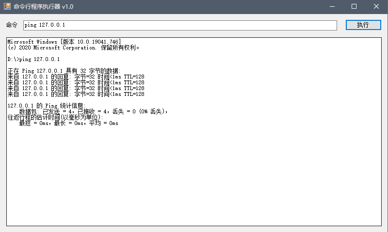

# CmdWrapperGUI
将命令行程序包装为GUI界面来执行的小工具！

### 介绍

使用C#开发的小工具，功能是将命令行程序包装为GUI程序，方便在图形界面中统一管理cmd程序执行。功能不断完善中...

### 截图

### 使用说明

更新中

### 更新日志

#### 2021-01-23
* 初始提交，开发中...

### 参考资料

命令行程序增加 GUI 外壳：https://www.cnblogs.com/conmajia/p/gui-shell-for-cmd-line.html
